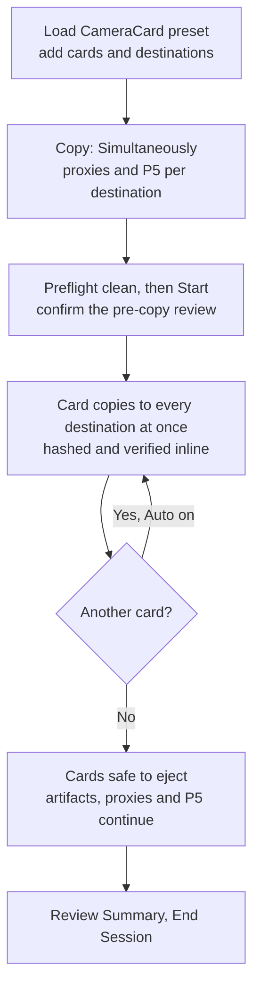

# CopyTrust — First Run

Cards copied to every destination at once, verified, with all artifacts, proxies and a P5
archive. Companion to the **CameraCard preset** demo.

## Run it

1. **Load the CameraCard preset** — Inline verification, all artifacts and proxies.
2. **Add the cards** — drag them in, or click them in the Available Volumes pool.
3. **Add the destinations.** Two or more is the fan-out case.
4. **Leave `Copy` on `Simultaneously`.** `In series` is the relay chain, a different job.
5. **Tick `Create proxies` and `Archive to P5`** per destination row.
6. **Turn `Auto` on** if you added more than one card.
7. **Check preflight**, then **`Start`** and read the pre-copy review before files move.

### After it starts

**Cards copy one at a time** — *Simultaneously* means the destinations, not the cards.
Counts are **file copies**: 47 files to two destinations counts toward 94. When copying
ends the cards are free; artifacts, proxies and P5 continue in the background, so leave
CopyTrust open. Finish with **Review Summary**, then **End Session**.

