# CopyTrust Illustrated Workflow Guide

Published from the reproducible screenshot manifest and workflow-scenario
generator in the private CopyTrust source repository.

This guide combines current UI screenshots with workflow-topology charts
for direct copying, fan-out, relay chains, post-copy actions, P5 archive,
offline handoff, restore, and hash re-verification.
Use the [2.7 Workflow QA Matrix](COPYTRUST_WORKFLOW_QA_MATRIX.md) for the
matching proof checks and evidence requirements.

For the complete control reference and operating detail, see the
[CopyTrust User Guide](CopyTrust_UserGuide.md). A printable version of this
guide is available as
[CopyTrust_Illustrated_Workflow_Guide.pdf](CopyTrust_Illustrated_Workflow_Guide.pdf).

## 01. Choose a copy mode

Select Card for camera-card ingest or Folder for general folder copies; each mode keeps an independent settings profile.

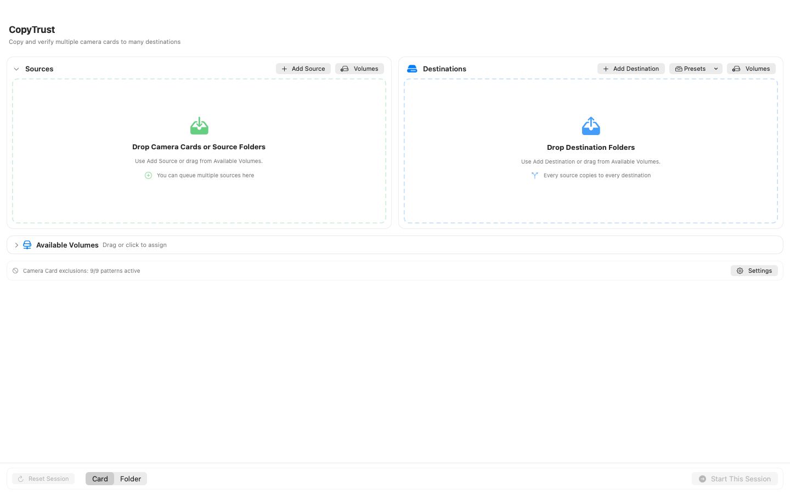

## 02. Prepare a direct session

Add one source and one or more destinations, confirm the naming preview, and check preflight before starting.

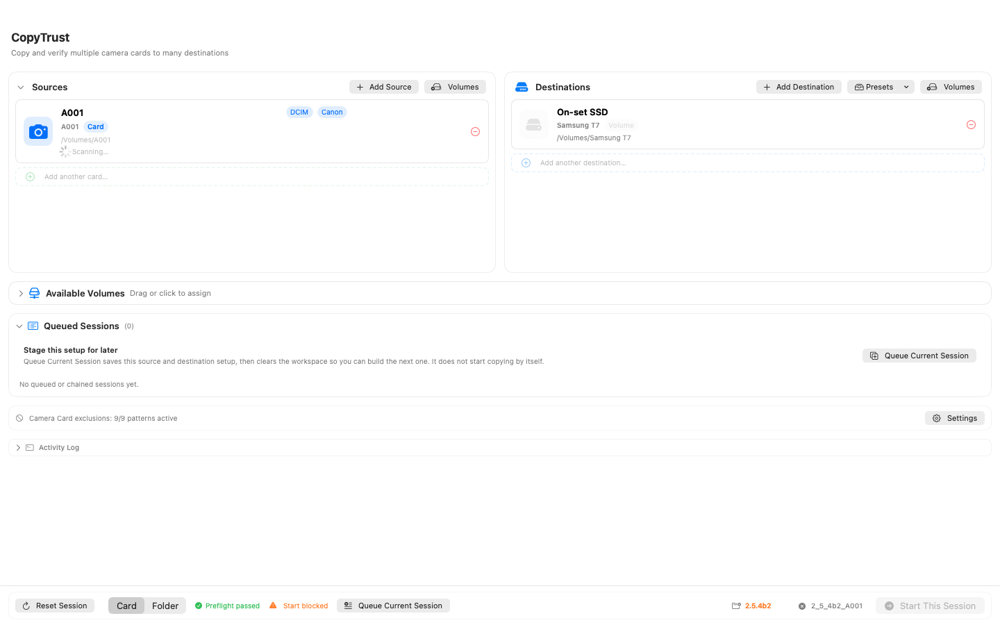

## 03. Stage mixed queued jobs

Queue separate Card and Folder jobs when different sources need different destinations or post-copy settings.

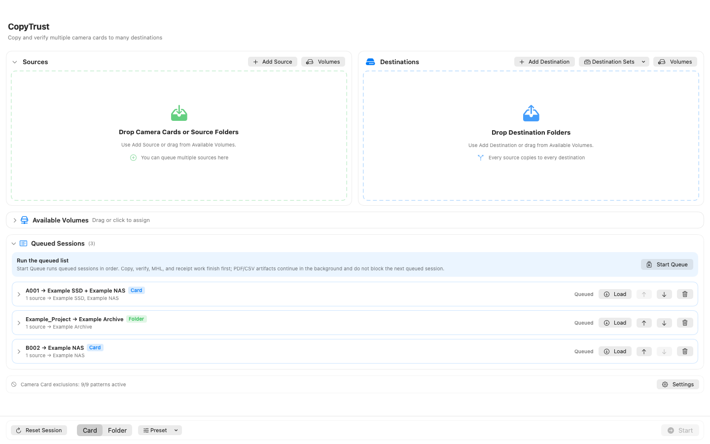

## 04. Build a relay chain

For A to B to C, order destinations fastest first and use Queue Relay Chain so each downstream leg waits for verified upstream output.

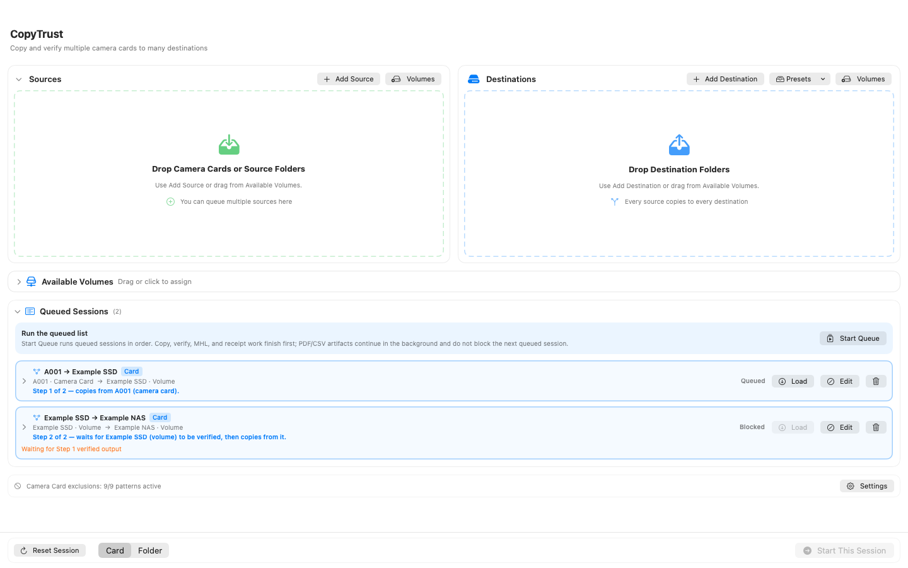

## 05. Set post-copy actions

Use the Post-Copy tab to configure confirmation, contact sheets, metadata, HTML trees, proxy media, and destination sorting for Card or Folder mode.

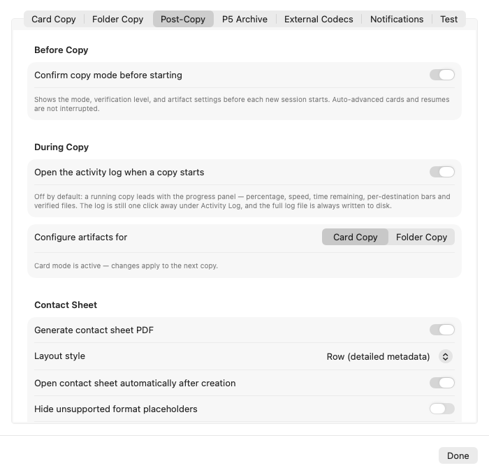

## Workflow Possibilities

The following charts separate copy topology from optional post-copy actions.
Every arrow into a green verified destination crosses that destination's own
verification gate. P5 archive submission is later and supplementary: it never
changes the original CopyTrust copy verdict.

### 6. Direct copy: A to B

Use for one source and one destination.

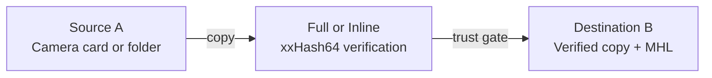

- Use Full or Inline when B may later be archived to P5.
- Quick proves size/existence only and does not create hash-backed MHL evidence.

### 7. Fan-out copy: A to B and A to C

Use when the same card needs two independent verified copies.

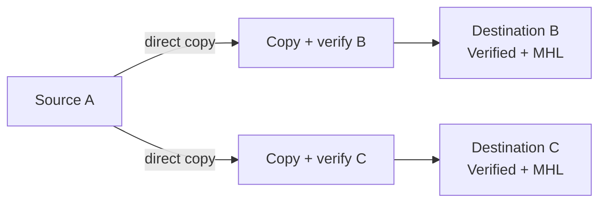

B and C are separate results. Inspect both destination verdicts and receipts;
neither destination silently depends on the other.

### 8. Relay chain: A to B, then B to C

Use when a fast first destination should feed a slower downstream destination.

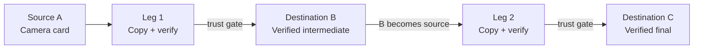

Leg 2 waits for B to become trust-complete. A failed Leg 1 blocks downstream
copying. With Destination Sort enabled, CopyTrust currently sorts only the
final relay destination.

### 9. Copy A to B, then archive B to P5

Use when B is the verified archive-master copy.

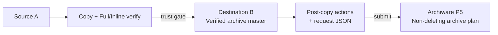

The selected P5 client must see B at the same absolute path. Confirm the P5 job,
archived paths, and searchable `CT_*` metadata in P5 Web.

### 10. Fan-out A to B and C, then archive designated B

Use when B is the archive master and C is a working or safety copy.

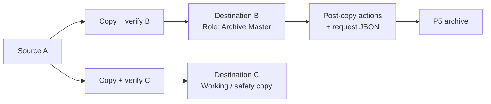

Set a destination role such as `Archive Master` so the intended copy is
unambiguous. C remains independently verified and is not silently added to B's
archive request.

### 11. Naming, sorting, artifacts, proxies, and archive order

Naming is decided as CopyTrust builds the delivered paths. Sorting and
derivatives happen only after the trust-critical copy and verification stage.

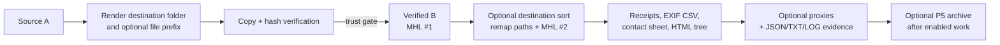

- A sorted delivery MHL describes the final layout; the source-layout MHL is
  retained as supporting evidence.
- Artifact, proxy, or P5 failure never upgrades or downgrades the verified
  original-copy result.

### 12. Offline P5 handoff, restore, and re-verification

The deferred request keeps the archive action reviewable when P5 is unavailable.

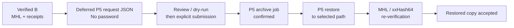

Archive presence is not restore proof. Accept restored media only after the
expected file count, paths, and hashes have been checked.
