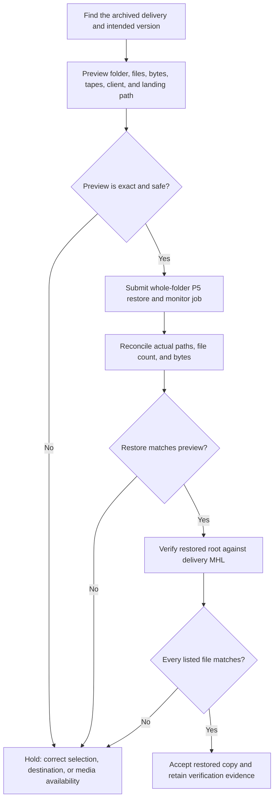

# CopyTrust → P5 Restore and Hash Verification Workflow

**Status:** Manual operating procedure for CopyTrust 2.7.0 Build 11 public prerelease
**Last updated:** 2026-07-31

This workflow closes the integrity loop after a CopyTrust delivery has been
archived to Archiware P5:

`capture → verified copy → MHL → P5 archive → P5 restore → MHL verification`

It separates three different proofs:

1. **P5 job completion** says that P5 completed its restore job.
2. **Restore reconciliation** checks that the expected paths, file count, and
   bytes arrived at the restore destination.
3. **MHL verification** recalculates each restored file's xxHash64 and compares
   it with the value recorded at ingest.

All three should pass before a restored copy is accepted.

## Current capability boundary

CopyTrust 2.7.0 can archive a Full- or Inline-verified destination to P5 and
write GUI-visible `CT_*` metadata, including `CT_XXH64`. It also preserves the
delivery MHL and the password-free P5 archive-request receipt.

CopyTrust does **not** currently submit a restore job or automatically verify a
completed restore. The current tools divide the work as follows:

| Stage | Current tool | Evidence |
| --- | --- | --- |
| Find the archived delivery | P5 Web or P5 Archive Browser | Archive index entry, path, version, `CT_*` metadata |
| Preview and restore a folder | P5 Archive Browser or P5 Web | Requested folder, client, relocate path, job ID/status |
| Reconcile the restored tree | P5 Archive Browser and/or operator inspection | Actual paths, file count, and bytes |
| Recalculate and compare hashes | CopyTrust **Verify Using MHL**, MHL Verify, or `mhl-tool verify` | Matched, mismatched, missing, and unreadable files |
| Search or spot-check one original | P5 Web `CT_XXH64` field | Searchable contextual copy of the ingest hash |

The MHL is the portable, file-by-file integrity authority. `CT_XXH64` helps
search and diagnose an item in P5, but it does not replace verification of the
complete delivery against the preserved MHL.

## Workflow



## Practical operator procedure

### 1. Identify the intended archive

Search P5 by the delivery folder or card name. CopyTrust metadata such as
`CT_SOURCE`, `CT_ASSET_ID`, `CT_CAPTURE_DATE`, `CT_XXH64`, frame/image size,
and original relative path can help disambiguate similar names.

If P5 contains multiple archived versions, explicitly choose the required
version. A matching folder name alone is not sufficient.

Retain the related CopyTrust evidence when available:

- delivery MHL;
- `COPYTRUST_P5_ARCHIVE_REQUEST_*.json`;
- CopyTrust receipt, manifest, and session log;
- P5 archive job ID.

### 2. Preview the restore

Prefer a **whole-folder restore** for a complete CopyTrust delivery. Before
submitting it, record:

- archive index and selected folder;
- expected descendant file count and logical bytes;
- required tapes/volumes, including offline media;
- receiving P5 client;
- `relocate` destination;
- computed landing folder;
- overwrite or collision risk.

The destination `client` is the P5 client that receives the restored files. The
`relocate` path belongs to that client and may not be a path on the Mac running
the operator UI.

For a directory restore, the expected layout is normally:

```text
<relocate>/<archived-folder-name>/<preserved subtree>
```

For example:

```text
relocate: /Volumes/Restore_Staging
archive selection: /Projects/Show/Camera/A001
expected landing root: /Volumes/Restore_Staging/A001
```

Do not silently replace a selected-file restore with its containing folder.
Individual file handles can flatten under `relocate` unless every entry has a
safe, explicit `targetPath`. Subset restore remains an advanced workflow that
needs collision checks and a preview of every output path.

### 3. Submit and monitor the P5 job

Submit the reviewed folder restore. Record the P5 restore job ID and monitor it
to a terminal state. Capture the final P5 job report when available.

A P5 `success` state is necessary, but it is not proof that the intended
content and layout arrived. Continue with reconciliation and hashing.

### 4. Reconcile the restored tree

Compare the completed restore with the preview:

- requested versus actual file count;
- requested versus actual logical bytes;
- expected versus actual relative paths;
- expected landing root versus actual landing root;
- missing, extra, unreadable, or overwritten paths.

Stop and investigate if these do not agree. Do not treat a successful job state
as permission to skip this check.

Filename normalization can differ between filesystems, particularly NFC versus
NFD Unicode. Report a path/name normalization difference separately from a
content mismatch: identical content hashes can prove the bytes are unchanged
even when the visible or encoded filename differs.

### 5. Locate the delivery MHL

Use the MHL that describes the files as archived:

- **Unsorted delivery:** normally the copy-time MHL associated with the
  destination.
- **Sorted delivery:** use the delivery MHL written for the post-sort layout;
  the original source-layout MHL remains supporting provenance.

Confirm that the MHL paths are relative to the restored delivery root. Do not
verify a changed layout against an MHL for the pre-sort layout.

### 6. Recalculate hashes

Choose one compatible verifier:

- CopyTrust → **Verify Using MHL**;
- the MHL Verify app;
- `mhl-tool verify`.

Select the restored landing root and the delivery MHL. The verifier reads each
MHL entry, finds the corresponding restored file, recalculates xxHash64, and
compares it with the ingest-time value.

Interpret the result as:

| Result | Meaning | Required action |
| --- | --- | --- |
| Matched | Restored bytes equal the ingest record | Accept this file |
| Hash mismatch | File exists but its bytes differ | Hold the restore; preserve evidence and investigate |
| Missing | MHL entry has no restored file | Check selection, P5 report, path mapping, and media |
| Unreadable/error | Verification could not prove the file | Fix access/storage error and rerun |
| Extra file | Present but not represented by this MHL | Classify as an expected artifact or investigate |

The MHL may intentionally describe the captured originals rather than every
generated PDF, CSV, HTML, proxy, receipt, or provenance artifact. Reconciliation
of the complete restored tree therefore remains useful even after all MHL
entries match.

### 7. Accept or hold

Accept the restored copy only when:

- the intended archive version and folder were selected;
- P5 completed the restore;
- actual paths, file count, and bytes match the approved preview;
- every required MHL entry was found and its recalculated hash matched;
- any extra supporting artifacts were expected and accounted for.

Retain the P5 restore job ID/report and exported MHL verification result with the
restored delivery. A failure in any gate should produce a hold, not a partially
trusted success.

## Safety and recovery notes

- Restore to a clean staging destination by default. Restoring over an existing
  tree can hide missing files or overwrite evidence.
- Confirm all required P5 media are available before starting a multi-tape
  restore.
- Keep the exact archive version in the receipt; repeated archives of the same
  path may represent different content.
- Do not expose P5 credentials in a receipt, MHL, script argument, or report.
- Keep the P5 archive job ID and restore job ID distinct.
- Retry only the failed stage when its inputs remain trustworthy. Never rewrite
  the capture-time MHL to make a restored mismatch pass.

## Planned improvement: coordinated Restore & Verify

This is a planned feature, not part of CopyTrust 2.7.0 Build 10.

The preferred design is a coordinated workflow in P5 Archive Browser, using a
shared MHL verification component or an explicit handoff to CopyTrust/MHL
Verify:

1. Search and select one exact archived folder/version.
2. Preview descendant paths, files, bytes, tapes, receiving client, relocate
   path, and output collisions.
3. Submit and monitor the P5 restore.
4. Reconcile the actual restored tree against the approved preview.
5. Locate or ask for the delivery MHL.
6. Recalculate restored hashes and present matched, mismatched, missing,
   unreadable, and extra results.
7. Write a combined receipt such as
   `RESTORE_VERIFICATION_<asset>_<timestamp>.json` plus a human-readable TXT or
   PDF summary.
8. Enable **Accept Restored Copy** only after every required gate passes.

The combined receipt should link:

- CopyTrust asset/session ID and archive-request receipt;
- P5 server/index, selected archive version, archive job ID, and restore job ID;
- requested and actual landing roots, paths, file counts, and bytes;
- MHL identity and hash algorithm;
- match, mismatch, missing, unreadable, and extra-file totals;
- verification start/end timestamps and app versions;
- resumable state and operator notes.

### Implementation phases

1. **Documented manual procedure** — this guide and repeatable fixtures.
2. **Shared evidence model** — versioned restore-verification JSON/TXT schema
   and reusable MHL verifier.
3. **P5 Archive Browser orchestration** — exact preview, whole-folder restore,
   monitoring, reconciliation, and safe path containment.
4. **CopyTrust/MHL handoff** — automatic MHL discovery or explicit selection,
   hash verification, and combined receipt.
5. **Site acceptance** — single- and multi-tape restores, multiple archive
   versions, sorted/unsorted deliveries, Unicode filenames, partial restores,
   interruption/resume, read errors, and intentional hash corruption.

### Acceptance gates for the planned feature

- Never widen a file/subset selection to a containing folder without an
  explicit new confirmation.
- Never report success from P5 job state alone.
- Show the receiving client and computed landing path before submission.
- Detect collisions and path escape before writing.
- Preserve the original MHL and all failed-verification evidence.
- Demonstrate a clean restore, a missing file, a changed byte, an unreadable
  file, a multi-tape request, and a filename-normalization case in automated or
  repeatable fixture tests.
