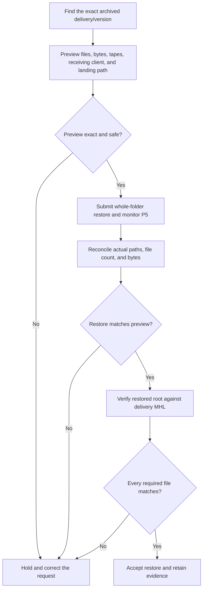

# CopyTrust → P5 Restore and Hash Verification

**Status:** Manual workflow for CopyTrust 2.7.0 Build 8 public prerelease
**Last updated:** 2026-07-31

This workflow closes the integrity loop:

`capture → verified copy → MHL → P5 archive → P5 restore → MHL verification`

Three separate checks are required:

1. P5 reports that its restore job completed.
2. The restored paths, file count, and bytes match the approved restore preview.
3. Recalculated hashes for the restored originals match the delivery MHL.

A restored copy should not be accepted until all three pass.

## What works today

CopyTrust 2.7.0 can submit a Full- or Inline-verified destination to Archiware
P5 after post-copy work. The archived originals receive GUI-visible `CT_*`
metadata, including `CT_XXH64`, and the destination retains its MHL, receipts,
and password-free P5 archive-request JSON.

Restore remains an operator action in P5 or P5 Archive Browser. Hash
verification is then run with CopyTrust **Verify Using MHL**, MHL Verify, or
`mhl-tool verify`. CopyTrust does not yet orchestrate those steps automatically.

| Stage | Tool | Proof |
| --- | --- | --- |
| Find the archived delivery | P5 Web or P5 Archive Browser | Folder/version and `CT_*` metadata |
| Preview and restore | P5 Archive Browser or P5 Web | Selection, client, destination, job ID/status |
| Reconcile restore | P5 Archive Browser/operator inspection | Actual paths, file count, and bytes |
| Verify restored bytes | CopyTrust, MHL Verify, or `mhl-tool` | Match/mismatch/missing/unreadable results |

`CT_XXH64` is useful searchable context and can help diagnose an individual
item. The MHL remains the portable file-by-file authority for the delivery.

## Operator flow



### 1. Find the correct archive version

Search P5 using the delivery folder/card name and, where useful, CopyTrust
fields such as `CT_ASSET_ID`, `CT_SOURCE`, `CT_CAPTURE_DATE`, `CT_XXH64`,
frame/image size, or original relative path. If a path was archived more than
once, explicitly choose the intended version.

Keep the associated evidence:

- delivery MHL;
- `COPYTRUST_P5_ARCHIVE_REQUEST_*.json`;
- CopyTrust receipt, manifest, and session log;
- P5 archive job ID.

### 2. Preview before restoring

Prefer a whole-folder restore for a complete CopyTrust delivery. Confirm:

- archive index and selected folder/version;
- expected descendant file count and logical bytes;
- required tapes or offline media;
- receiving P5 client;
- `relocate` path and computed landing root;
- overwrite and collision risk.

The destination `client` is the P5 client that receives the files. Its
`relocate` path may not belong to the Mac showing the operator interface.

A folder restore normally lands at:

```text
<relocate>/<archived-folder-name>/<preserved subtree>
```

Example:

```text
relocate: /Volumes/Restore_Staging
selection: /Projects/Show/Camera/A001
landing root: /Volumes/Restore_Staging/A001
```

Individual file handles can flatten under `relocate` unless each entry has an
explicit safe `targetPath`. Do not silently widen a subset request to its
containing folder. Subset restore requires per-output preview and collision
checking.

### 3. Restore and reconcile

Submit the reviewed restore and retain its P5 job ID and final report. P5 job
success alone is not content proof.

Compare the completed output with the preview:

- requested versus actual paths;
- requested versus actual file count;
- requested versus actual logical bytes;
- expected versus actual landing root;
- missing, extra, unreadable, or overwritten paths.

Stop and investigate any difference.

Some filesystems normalize Unicode filenames differently, such as NFC versus
NFD. Record a name/path normalization difference separately from a content
mismatch. Matching content hashes can prove that the file bytes are unchanged.

### 4. Select the correct MHL

Use the MHL that describes the archived layout:

- for an unsorted delivery, this is normally the destination copy-time MHL;
- for a sorted delivery, use the delivery MHL for the post-sort layout and keep
  the source-layout MHL as provenance.

The MHL paths must resolve relative to the restored landing root.

### 5. Recalculate and compare hashes

Use CopyTrust **Verify Using MHL**, the MHL Verify app, or `mhl-tool verify`.
Select the restored landing root and delivery MHL. The verifier finds each
listed file, recalculates xxHash64, and compares it with the ingest-time value.

| Result | Meaning | Action |
| --- | --- | --- |
| Matched | Restored bytes equal the ingest record | Accept that file |
| Hash mismatch | File exists but its bytes differ | Hold and investigate |
| Missing | MHL entry has no restored file | Check selection, P5 report, and path mapping |
| Unreadable/error | The file could not be proved | Fix the access/storage problem and rerun |
| Extra file | Present but absent from this MHL | Classify as expected artifact or investigate |

An MHL may intentionally cover the captured originals rather than every
generated PDF, CSV, HTML, proxy, receipt, or provenance artifact. That is why
whole-tree path/count/byte reconciliation remains a separate gate.

### 6. Accept or hold

Accept only when the correct folder/version was restored, P5 completed, actual
paths/count/bytes match the preview, every required MHL file was found and
matched, and all extra supporting artifacts are accounted for.

Keep the P5 restore job ID/report and exported MHL verification result with the
restored delivery. Never modify the capture-time MHL to make a mismatch pass.

## Planned: coordinated Restore & Verify

This is a future improvement, not a CopyTrust 2.7.0 feature.

The proposed workflow would coordinate P5 Archive Browser with a shared MHL
verifier or explicit CopyTrust/MHL Verify handoff:

1. Select one exact archived folder/version.
2. Preview paths, files, bytes, tapes, client, landing path, and collisions.
3. Submit and monitor the whole-folder restore.
4. Reconcile the actual restored tree.
5. Locate or request the delivery MHL.
6. Recalculate hashes and show matched, mismatched, missing, unreadable, and
   extra files.
7. Write `RESTORE_VERIFICATION_<asset>_<timestamp>.json` and a readable summary.
8. Enable **Accept Restored Copy** only when all gates pass.

The combined receipt should link the CopyTrust session/asset and archive
request, P5 server/index and exact archive version, archive and restore job IDs,
requested and actual landing paths/counts/bytes, MHL identity, verification
totals, timestamps, app versions, and operator notes.

### Planned implementation and test gates

- Define a versioned restore-verification receipt and reusable MHL verifier.
- Add exact whole-folder preview, restore monitoring, reconciliation, safe path
  containment, and resumable state to P5 Archive Browser.
- Add automatic MHL discovery or an explicit CopyTrust/MHL Verify handoff.
- Test clean and intentionally corrupted restores, missing/unreadable/extra
  files, multiple archive versions, sorted and unsorted layouts, multi-tape
  restores, interruption/resume, collisions, and Unicode normalization.
- Never widen a subset selection without explicit confirmation.
- Never infer content success from P5 job state alone.
- Always show the receiving client and computed landing root before submission.
- Preserve the original MHL and all failure evidence.
