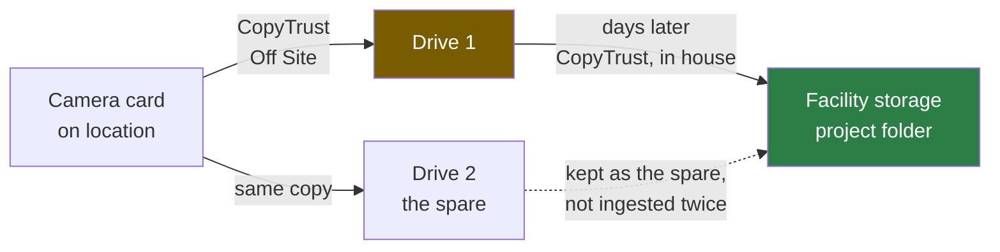
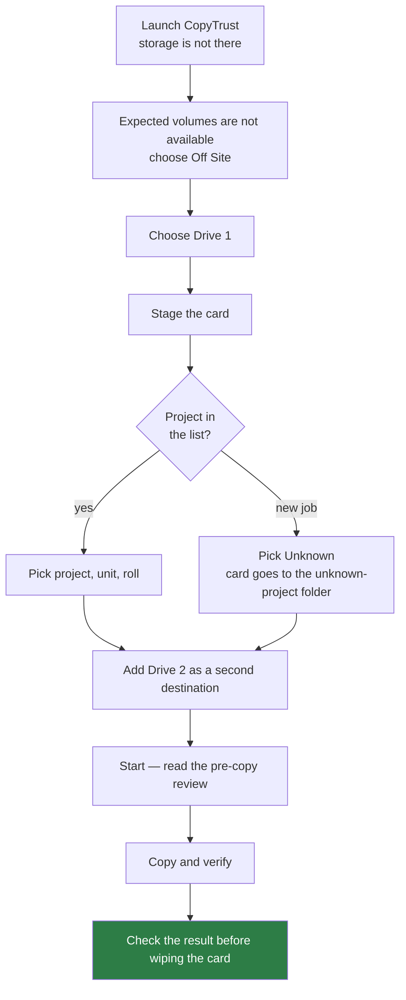
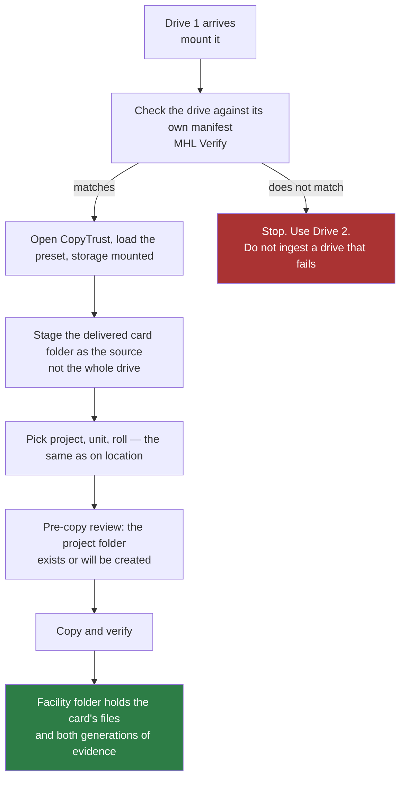

# CopyTrust — off-site capture, and bringing the drive home

Date: 2026-10-08 · For CopyTrust 2.9.5 (build 36)

This is the working order for a shoot away from the facility: a camera card copied to a drive on
location, and that drive copied into the facility's storage days later by someone else. It says what
to do, what each step writes and where, and how the files that result show the card's whole history.

Two things are kept apart throughout:

- **Verified in the code** — stated plainly.
- **To confirm in the field** — marked *Confirm*. These are expected from how the code is written
  but have not yet been seen on a real shoot.

And a third, in section 7: what the record **does not say**, so nobody relies on it.

---

## 0. What needs an enforced-naming preset, and what does not

Off site is defined against a preset: CopyTrust can only say "the drives you expect are not here" if a
preset names drives. So **declaring off site, and everything that hangs off the declaration, needs an
enforced-naming preset, and applies to Card mode** (enforcement does not apply to Folder mode). The
card → drive → facility **chain** does not: it works for any folder CopyTrust delivered.

| Part | Needs the preset? | Notes |
| --- | --- | --- |
| The off-site banner, *Declare Off Site…*, the *Off site* box on a drive | **Yes** | Nothing to compare against without a preset that names drives or a project list. |
| *Off site* in the receipt and `PROVENANCE`; the copy-log line | **Yes** | They follow the declaration. |
| Project folders created on the drive; the proxy default for the drive | **Yes** | Both are preset options, and both need the declaration. |
| Drive volume name and ID in the receipt and `PROVENANCE`; the `.mhl`; `Receipts` | No | Every copy records the drive it wrote to. |
| Finding the earlier copy at staging, matching it to the drive, the `continuedFrom` chain block | No | Any folder CopyTrust delivered, whatever mode or preset. |
| Checking the drive against its manifest and record | No | Needs **Inline** or **Full** verification. |
| The original camera card as P5's *Source Card* | No | Follows the chain. |
| *Use these answers* (project, unit, roll) | **Yes** | Only an enforced copy records them, so a plain copy has nothing to offer. |
| Earlier proxies kept; the relink-alias folder left out | No | Apply to any second copy. |

**So without a preset** the workflow still works and is still provable end to end, but it is quieter:
you copy the card to the drive as an ordinary destination; the drive's receipts record the drive's
volume ID but do **not** say "off site" (there was nothing to declare against); no project folders are
made and there is no proxy default; and at the facility the folder is staged, matched to its drive,
checked against its manifest and record, and carried forward in the chain. You pick project, unit and
roll yourself, because the first copy recorded none.

---

## 1. The chain



Each hop is a verified copy that writes its own evidence. Nothing is rewritten: the evidence from the
first hop is carried into the second as ordinary files, so the folder that arrives in house holds
**both** generations side by side.

**Make two drives.** Once a card is wiped the copy is the original, so one drive is not a backup.
Bring both home; ingest one; keep the other until the facility copy has verified.

---

## 1a. How off-site mode starts

Off site is something **the operator declares**. CopyTrust notices when it might apply and offers
the button; it never switches itself.

| Step | What happens |
| --- | --- |
| **CopyTrust looks** | At launch, and again when you load a preset that changes the convention (loading the one already in force changes nothing), it compares the drives the **preset names** (not counting a proxies-only destination) with what is mounted. For an older preset that names no drives, it looks at the preset's project folders instead. A preset that has neither has nothing to compare, so nothing is checked and there is no banner. |
| **Any one missing is enough** | If a single drive the preset expects is not there, an orange banner appears: *Some project volumes are not available*, with **Try Again**, **Open SMB Connect** (if installed) and **Off Site…**. It does not interrupt and does not stop a copy. |
| **The operator declares** | Press **Off Site…** on the banner. When nothing is missing (the share is reachable over a VPN, say, but you are still copying to a drive in a bag) a quiet *Declare Off Site…* link sits under the drives, shown whenever a preset that names drives or a project list is loaded. |
| **Then a drive is chosen** | A picker opens at once. Pick Drive 1. A read-only volume is refused. |
| **Ending it** | **End Off Site**, on the *Working off site* line (and in the banner while the preset's drives are missing), ends the declaration and clears what is remembered for a relaunch. Drives already added stay staged but stop being recorded as off site; the preset's drives are looked at again, and if they are still missing the ordinary banner returns. When a declaration was made because the preset's drives were missing and all of them are mounted again, the line says *The preset's volumes are mounted again.* It is a suggestion only: mounting the facility storage never ends off-site mode by itself. A declaration made while nothing was missing gets no such suggestion. |
| **Drives added after that** | A drive you add by hand while declared is off site too, and its row shows an **Off site** box you can untick. A drive the **preset** stages, such as a facility share that mounts late, is never treated as off site. |

What declaring changes: the banner reads *Working off site*; the drives are marked, so their
receipts say so (section 4); the preset's off-site rules apply to them, namely project folders
(section 3) and the proxy default below; and the declaration is written to the session log.

**It survives a relaunch, but only while it is still true.** If the laptop restarts mid-shoot, CopyTrust
puts the declaration and the drives back, and says so in the banner (*Restored from your earlier
declaration*). It does that only when **all** of these hold, so it can never carry into the next day at
the facility:

- something the preset expects is **still missing**, so a Mac back at the facility with its NAS mounted
  is never called off site;
- it is the **same preset** (by content, not name);
- the **same physical drive** is mounted (by volume ID, not name);
- it was last used **within 14 days**.

Otherwise it is ignored and you declare again. Loading a different preset, or pressing **End Off Site**, also forgets it. Removing
the drive, or unticking *Off site* on its row, removes it from what is remembered. A declaration made
with *Declare Off Site…* while nothing was missing is remembered only while something is missing.
Without a preset there is nothing to declare against, so a plain copy is just a copy, and its receipts
will not say off site.

**Proxies on an off-site drive** are set by the preset: *Don't make proxies off site* (the default),
*Make proxies off site*, or *Let the operator decide*. It only sets the starting state of the drive's
**Create proxies** box when the drive is declared; tick or untick it on the day. With the default,
the pre-copy review says *off site, made at the facility* in place of a warning, because no proxies
there is the preset's answer and not an omission.

---

## 2. Before you leave (with the network up)

1. **Open CopyTrust with your preset loaded and the facility storage mounted.** This is the only step
   that cannot be done on location. CopyTrust scans the storage for projects and keeps the list on
   disk; off site, with no network, that list is what you pick from.
   **No list on this Mac?** If the facility storage cannot be reached from here, **Load project list…**
   (next to *Working off site*) fills the picker without making that storage a destination. *From a
   saved list* reads the CSV that **Save project list…** writes, or a plain text file with one project
   per line (`2026-014 Some Project`, or number and name in two columns). *From a volume or folder*
   reads the projects once from a mounted volume or from its Projects folder. Either way the list is
   kept on disk like a scan, and the status line says it was loaded by hand and from what. Nothing
   in it has been checked against storage, so a project on it may not exist on the drive yet; the
   pre-copy review lists the folders that will be made.
2. **Check the list is real.** On the Destinations panel choose **Show project list…**. It shows every
   project found and what could not be read. A project missing here will not be offered on location.
3. **Check what the preset allows on a drive.** The preset wizard's last step has *Let operators
   create a project folder on an off-site drive* (**off by default**; without it a card goes to the
   dated ingest folder on the drive, still named correctly and filed later) and *Proxies on an
   off-site drive* (**don't make them** by default; they are made at the facility).
4. **Name the drives so they can be told apart.** Two drives called `Untitled` are indistinguishable
   in a bag and in a receipt. Use `SHOOT_A_01` and `SHOOT_A_02`, or similar. Format them for the Mac.
5. **Set verification to Inline or Full.** Those produce the hashes that the manifest and the later
   check depend on. Quick does not.
6. **If you make proxies or contact sheets,** confirm ffmpeg. The pre-copy review warns when it is
   missing, but warning on location is late.
7. **Write down the project numbers you expect,** including any that are new and not in the list.

---

## 3. On location



1. CopyTrust shows the orange banner saying the expected volumes are missing (section 1a). Choose
   **Off Site…**. This is a declaration, never automatic; it is written to the session log.
2. A picker opens. Choose **Drive 1**. (Read-only volumes, such as a mounted disk image, are refused.)
3. **Add Drive 2** as a second destination so both are written in the one pass. Because you have
   declared, it is marked off site too (its row shows the **Off site** box); check that it is.
4. Stage the card. Pick the **project** from the list, then **unit** and **roll**. The card is named
   by the same convention as in house, so it files correctly later.
5. **Read the pre-copy review.** With the preset's off-site option on and the project in the list, it
   lists every folder it will create on Drive 1 and says how old the project list is. Check:
   - the project folder name is the one you expect;
   - the list date is the last time you were in the facility, not something older;
   - both drives are listed, each with its path.
6. **Start.** When it finishes, before the card goes anywhere:
   - the result shows the copy verified, on **both** drives;
   - open each drive's delivered folder and confirm `Receipts` and the `.mhl` are there (section 4);
   - eject the card only after that.

**A new job that is not in the list.** Pick Unknown. The card goes to the preset's unknown-project
folder on the drive, named by the convention, and is re-filed at the facility. CopyTrust does not
invent a project folder it cannot check.

---

## 4. What is on the drive afterwards

For a card staged as project `2026-107` with unit `ACAM` and roll `3`, with the preset's option on, a
blank drive ends up like this. Names in angle brackets depend on the preset and the moment.

```text
SHOOT_A_01/                                   the drive, as you named it
└── Projects/
    └── 2026/
        └── 2026-107 Harbour Lights/          made from the project list
            └── Footage/                      the preset's landing folder
                └── 2026-107 Harbour Lights_ACAM_roll3/   the delivered card folder
                    ├── <the card's files, as they were on the card>
                    ├── CopyTrust - <date> at <time> - <card name>.mhl
                    └── Receipts/
                        ├── ingest_<folder>_S<session>_<stamp>.txt
                        ├── ingest_<folder>_S<session>_<stamp>.log
                        ├── PROVENANCE_<card name>_<stamp>.json
                        └── <contact sheet, EXIF CSV, HTML tree — if turned on>
```

What each one is:

| File | What it shows |
| --- | --- |
| The delivered folder name | Project, unit and roll, from the preset's convention. The first thing anyone sees. |
| `….mhl` at the folder's root | A hash for every file copied, with the tool, the operator and the dates. This is what later proves the drive still matches. |
| `Receipts/ingest_….txt` | The plain-language receipt of that copy: what was copied, where, and how it verified. For an off-site copy it says so in the header (`Off site: yes`), marks the drive, and names its volume and volume ID. |
| `Receipts/ingest_….log` | The log of that copy. |
| `Receipts/PROVENANCE_….json` | For every file, where it came from and where it went, with its hash and size, plus the settings that shaped the names. Also the card's name, its path and its volume ID, the session ID and the destination, and the **drive's** volume name and ID and an `offSite` flag. |
| Contact sheet / CSV / tree | Only if turned on. Pictures and camera metadata. |

On a macOS package such as a `.fcpbundle`, `Receipts` sits **beside** the package, never inside it.

Both drives hold the same thing, each with its own receipts. They are siblings, not one derived from
the other.

**If the project folder was not made** (option off, project not in the list, drive not declared off
site), the same delivered folder sits in the preset's ingest folder instead:

```text
SHOOT_A_01/_Ingest/<date>/2026-107 Harbour Lights_ACAM_roll3/…
```

Everything else is identical, and the name is already correct, so it files at the facility.

---

## 5. Coming home: the second ingest, in house

The drive is now the **source**. The aim is to put the delivered card folder into the facility's
project folder and keep the drive's evidence alongside the facility's own.



1. **Mount Drive 1.** CopyTrust now checks the drive against the manifest and the provenance record
   the first copy left, as it reads the files (needs **Inline** or **Full** verification). Staging shows
   *The manifest CopyTrust wrote when it copied this folder to this drive* with a note that the drive will
   be checked. The result is in the summary under **Source Provenance** as **Drive**, and in the receipt.
   **The answer arrives with the copy, not before it**, so a drive that has changed is found after its
   files are already in the facility copy. If you would rather know first, run MHL Verify on the
   delivered folder before staging it: load the `.mhl` and point it at that folder. Matched means the
   drive is the same as when it was written. Anything missing or different: stop, use Drive 2, and say
   so in the job notes.
2. **Open CopyTrust normally,** with the preset loaded and the facility storage mounted. This is an
   ordinary on-site session; no Off Site.
3. **Stage the delivered card folder as the source,** that is
   `…/2026-107 Harbour Lights_ACAM_roll3`, **not the drive and not the project folder above it.**
   Staging the whole drive would copy the drive's `Projects/…` tree into the facility folder as if it
   were the card's contents.
4. **Use Card mode,** where the naming convention and destination rules apply. Folder mode is not
   enforced and would skip them.
5. **Use the earlier answers.** Under the staged folder CopyTrust shows a line such as *Copied by
   CopyTrust on 7 Oct from CARD_A01 to SHOOT_A_01, off site*, with **Use these answers**. Press it to
   take the project, unit and roll the first copy recorded; nothing is filled in until you do. The
   receipt then says the answers were taken from the earlier copy. If the line is missing, or says the
   record is for a different drive, pick them by hand from the folder name.
6. **Read the pre-copy review.** The destination is the facility's project folder. If the project
   already exists there, the card files into it. If not, the existing missing-project rule applies
   (the preset's *create a project folder* setting).
7. **Start,** and check the result as in section 3.

### What the facility folder holds

The delivered folder arrives as the source, so its `Receipts` folder and `.mhl` come with it, and
this copy adds its own. The layout below is what the real writers produce, checked in an automated
two-copy test (two `.mhl`, two `PROVENANCE` files, two receipts). *Confirm* the per-copy `.log` files
on a real shoot. It is:

```text
2026-107 Harbour Lights/Footage/2026-107 Harbour Lights_ACAM_roll3/
├── <the card's files>
├── CopyTrust - <date> at <time> - <card name>.mhl     written on location (card → drive)
├── CopyTrust - <date> at <time> - <folder name>.mhl   written now (drive → facility)
└── Receipts/
    ├── ingest_…S<session A>….txt / .log               written on location
    ├── PROVENANCE_<card name>_<stamp>.json            card → drive 1
    ├── ingest_…S<session B>….txt / .log               written now
    └── PROVENANCE_<folder name>_<stamp>.json          drive 1 → facility
```

The two sets differ by session ID and timestamp, so neither overwrites the other. Read together they
are the history:

| Question | Where it is answered |
| --- | --- |
| What was on the card? | The first `.mhl` and first `PROVENANCE`, written from the card. |
| Which card, and when was it copied? | The first `PROVENANCE`: card name, path, volume ID, session, timestamps. |
| Did it reach Drive 1 intact? | The first `.mhl`, and MHL Verify run in step 1. |
| Where did it go next, and who did it? | The second `PROVENANCE`: source is Drive 1's folder and its volume ID; the second receipt names the operator. |
| Is the facility copy intact? | The second `.mhl`, hashed from Drive 1 and again at the destination. |
| Is the facility copy the card? | Yes by chain: card = Drive 1 (first manifest) and Drive 1 = facility (second manifest). Two manifests, not one. |

**Proxies.** Proxies made in the field are kept as they arrived and are not overwritten: where a
proxy receipt from the field is found, the facility's proxies go in a separate `Proxies <date>`
folder inside the proxy folder. Where the preset sets a pooled proxy path, field proxies sit in the
project beside the delivered folder and are not part of what is staged, so the facility simply makes
its own. The field's `Final Cut Relink Aliases` folder is left out of the copy by default, because
its aliases point at the drive, and the facility writes its own.

*Confirm:* the folder root will hold **two** `.mhl` files. Third-party tools that read every `.mhl`
in a folder will see both, and the older one lists the same files. If that is a problem for a
client's tooling, move the older one into `Receipts` after the copy verifies.

---

## 6. Afterwards

- **Keep Drive 2** until the facility copy has verified and, ideally, archived. Do not ingest it as
  well: that makes a second facility copy and a second set of receipts for the same card.
- **Do not reformat Drive 1** until the job's archive is done, for the same reason a card is not
  wiped early.
- The session summary and the receipts are the record. Nothing else needs writing down, except the
  project numbers that were new (next section).

---

## 7. What the record says, and what it does not

Plainly, so no one assumes more than is there.

**Recorded since 2.9.5**

- The receipt (text and JSON) and `PROVENANCE` say a copy was made off site, and name the drive by
  volume name and volume ID. A copy made before 2.9.5 does not; for those, the session log on the
  laptop is the only record.
- A folder carried to the facility is matched to its drive by volume ID, its earlier answers are
  offered, and the chain is written into the facility's own `PROVENANCE` (`continuedFrom`) and the P5
  archive request, where the **Source Card** is the camera card.
- With Inline or Full verification the drive is checked against its own manifest and provenance
  record, reported as **Drive**. Not done with Quick verification, and not for a copy made before the
  drive's volume ID was recorded.

**Still not recorded or not done**

1. **A project not in the list is not flagged for confirmation on return.** Pick Unknown, and
   re-file with the facility's project number when it exists.
2. **The project list can be old.** It is as old as the last time CopyTrust ran with the storage
   mounted. The pre-copy review shows the date. A project created at the facility after that date is
   not in the list.
3. **The drive check arrives with the copy, not before it.** A changed file is found after it is
   already in the facility copy. Run MHL Verify first to know beforehand.
4. **Only the project folder and its landing folder are made on the drive,** not the facility's whole
   folder template.
5. **No new P5 index fields.** The original card is in the existing *Source Card* field; the rest of the
   chain is in the request file archived beside the footage, and both generations of `Receipts` are
   archived with the footage as evidence.

---

## 7a. Where all of this is recorded

| Where | What it holds |
| --- | --- |
| This document | The running order, what is written where, what needs what, and what is not recorded. |
| [CopyTrust_OffSite_OperatorTest.md](CopyTrust_OffSite_OperatorTest.md) | A printable test sheet: copy a card to a drive off site, then bring the drive in. |
| [CopyTrust_UserGuide.md](CopyTrust_UserGuide.md) | The settings (the preset's off-site options, exclusions) and a summary, in the Receipts and Enforced Naming parts. |
| In the app: Help ▸ **Off Site Capture** | The same running order, in the app. |
| [RELEASE-NOTES-2.9.5.md](../RELEASE-NOTES-2.9.5.md) | What changed in the release that introduced it. |

---

## 8. A checklist to print

**Before leaving**
- [ ] Opened CopyTrust with the preset loaded, storage mounted, network up
- [ ] *Show project list…* contains the jobs expected
- [ ] Preset allows folders on an off-site drive (if wanted)
- [ ] Two drives, named distinctly
- [ ] Verification Inline or Full; ffmpeg present if proxies are on

**Each card**
- [ ] Off Site declared; Drive 1 chosen; Drive 2 added
- [ ] Project, unit, roll picked; the pre-copy review read, list date noted
- [ ] Both drives verified; `Receipts` and `.mhl` present on each
- [ ] Only then: eject and keep the card

**In house**
- [ ] Drive 1 checked against its `.mhl` in MHL Verify
- [ ] Delivered card folder staged as the source, in Card mode
- [ ] Same project, unit, roll as on location
- [ ] Facility copy verified; both generations of `Receipts` present
- [ ] Drive 2 kept until the archive is done

---

*See also:* [CopyTrust_UserGuide.md](CopyTrust_UserGuide.md) (Receipts & Logs, Enforced Naming),
[CopyTrust_OffSite_OperatorTest.md](CopyTrust_OffSite_OperatorTest.md).
